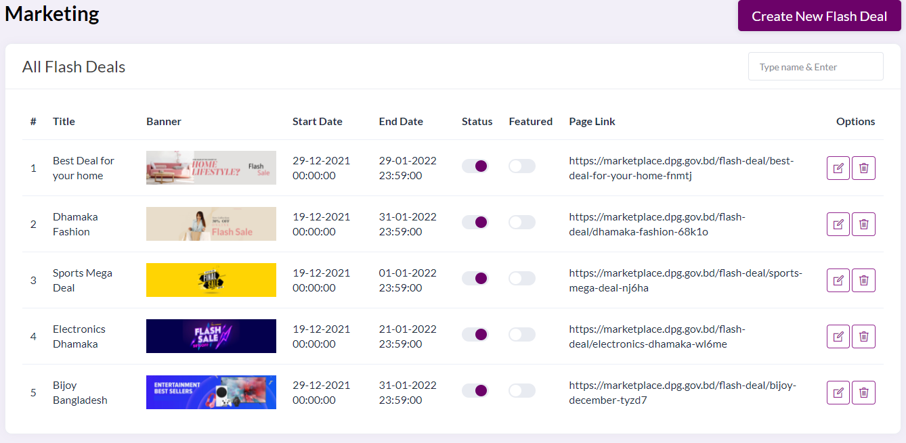
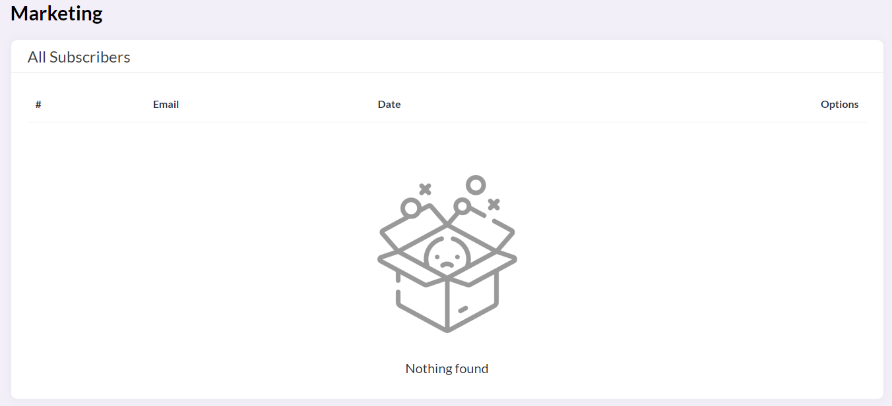
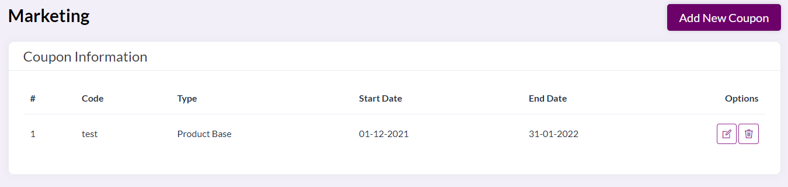

# Marketing Features
- [Flash Deals](#flash-deals)
- [Subscribers](#subscribers)
- [Coupon](#coupon)

# Flash Deals

**This feature allows us to configure what banners are displayed for a flash sale campaign and their associated webpages in the website**

The fields in the table representing all flash deals are:

**Title** This is the title of the banner

**Banner** This is the image that will represent the campaign

**Start date** is the date from  this banner photo will be available

**End date** is the last day to which this banner will be available

**Status** is a toggle which allows us to configure whether or not we will include this banner in the flash sale banners

**Featured** is a toggle for whether or not this item is in the featured list

**Page link** Refers to the URL of the page in which clicking on the banner will redirect to

Options

**Edit** will allow us to change these details for the banner

**Delete** allows us to delete this banner from the flash sale banners

# Subscribers

**This feature allows us to view all registered people who have subscribed to the newsletter by email. We have the option of including them in a mail campaign, or delete entries**

# Coupon

**This feature allows us to view and change coupons which are accepted for purchase items**

We can configure the start date and end date for which the coupon will be valid in the website, as well as add/update/delete coupon codes 
