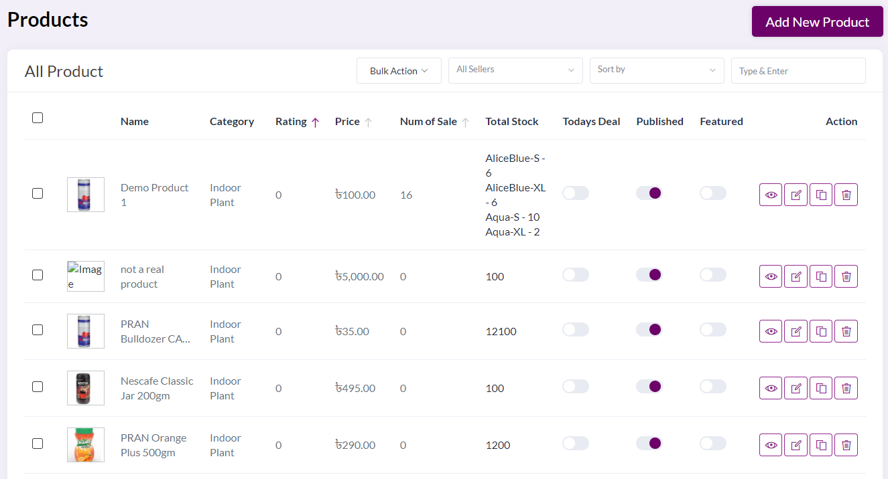
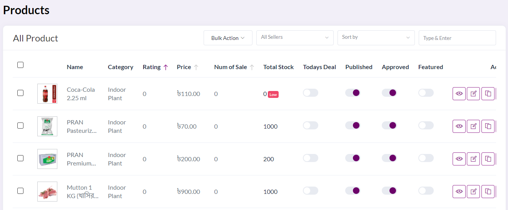
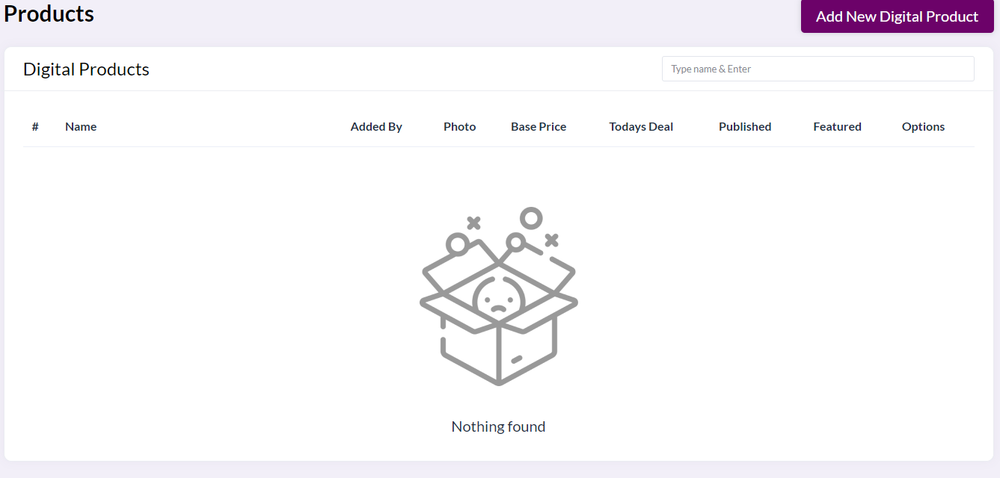
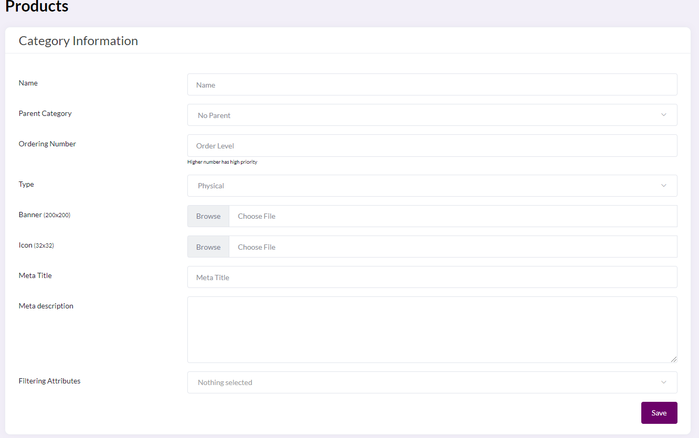
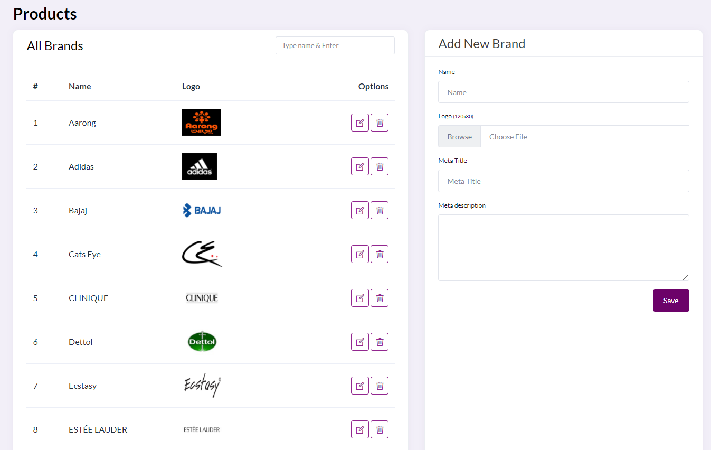
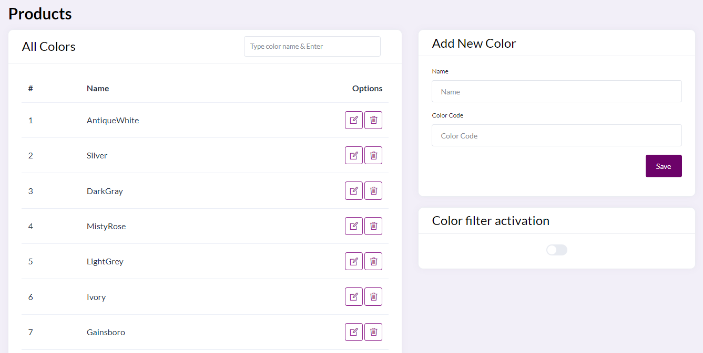
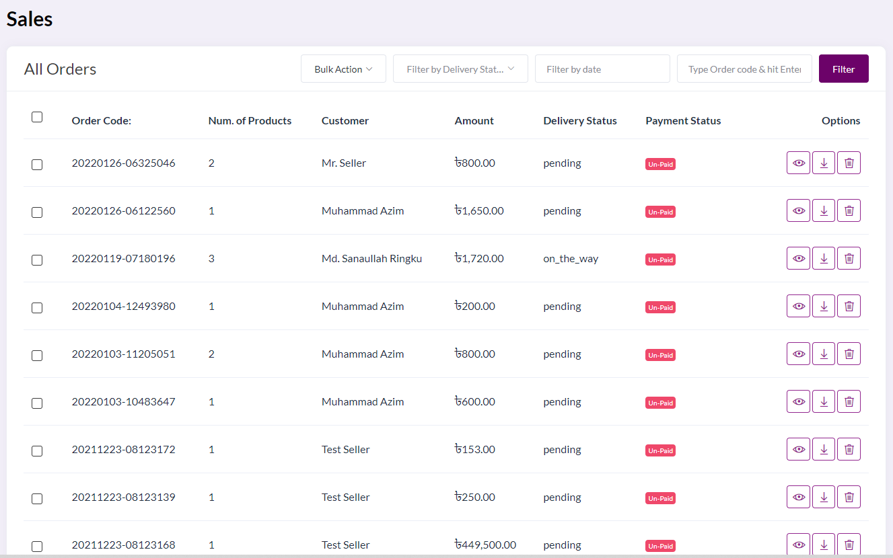
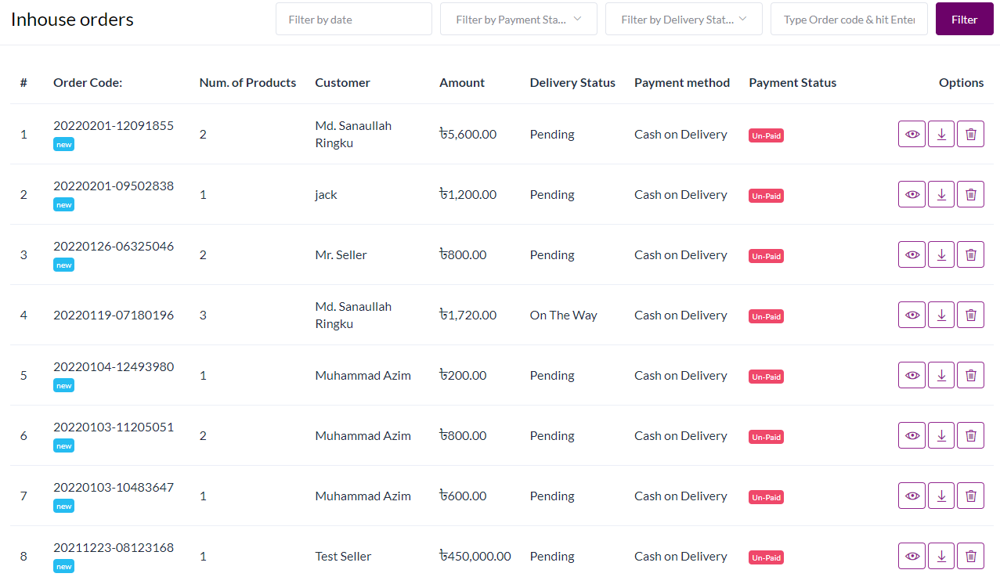
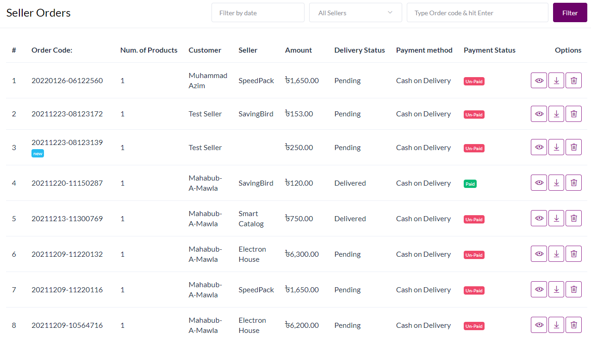
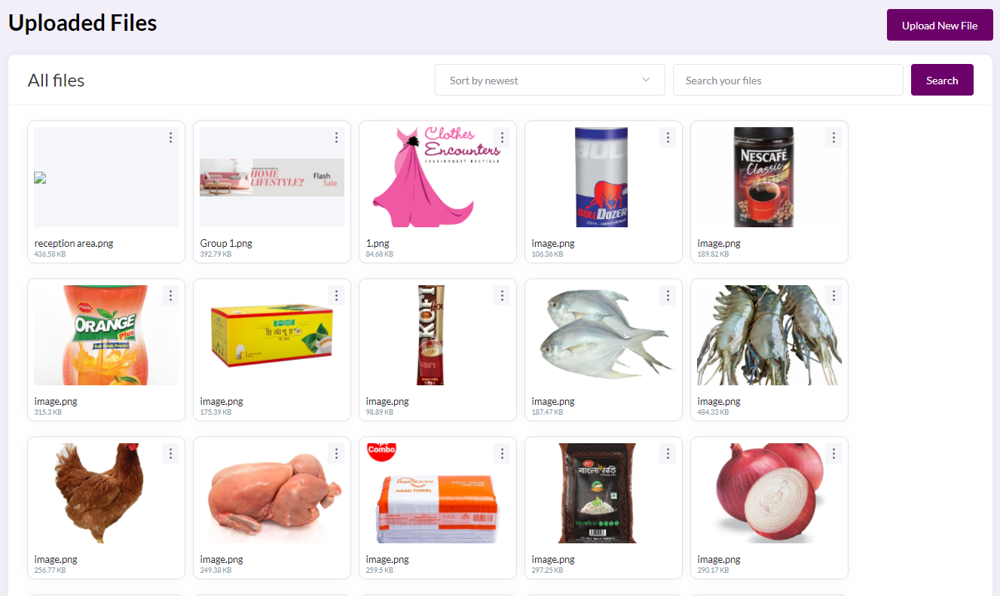

# Product Features
- [Add New Product](#add-new-product)
- [All products](#all-product)
- [In-House Products](#in-house-products)
- [Seller Products](#seller-products)
- [Digital Products](#digital-products)
- [Bulk Import](#bulk-import)
- [Bulk Export](#bulk-export)
- [Category](#category)
- [Brand](#brand)
- [Attribute](#attribute)
- [Colors](#colors)
- [Product Reviews](#product-reviews)

# Add New Product

**This feature allows us to add a new product into the inventory list of items available in the website. It allows us to qualify all the different criterias and specifications of the product, as well as it's relevant files and images.**

**Product name** This is the name that will appear for that product in the website

**Category** This is the category under which this product falls under. These categories are already defined previously and will appear as a drop-down list to choose from.

**Brand** is the company brand to which this item belongs and these brands will be predefined and come as a drop-down list.

**Unit** refers to the unit by which we can measure these items so this can be pieces or a weight to like kilograms etc.

**Minimum purchase quantity** is the minimum number of items of it that must be purchased at at a time. The default value is one.

**Tags** refer to words that can be used to find this item if it is searched. This helps the customer to find the item more easily even if they are unable to define it by its exact name. 

**Gallery images** These are images that will appear of that product in large size. The default size configuration for images in the gallery is 600 pixels by 600 pixels.

**Thumbnail image** is a small image that will appear in the search results or in other areas in the website. There should be some blank space around the main object of the image in the thumbnail image because sometimes the image is cropped in order to fit into certain shapes or user interfaces.

**Shipping configuration**

*Free shipping* sets the shipping cost to be completely free.

*Flat rate* is if the shipping fee is a fixed rate no matter how many items is purchased

*Is Product Quantity Multiply* refers to if the shipping will be multiplied for every item that is shipped. For example, if one item's shipping cost is five dollars - if we select this toggle, that means if two items are selected then the shipping cost will be 5X2 = $10.

**Low stock quantity warning** This refers to a warning sign that will be presented in the product page whenever a stock of this item goes to this fixed number or lower. The default quantity for this is one.

**Stock visibility state**
We can select this toggle if we want to show how many of the stock is available in our inventory

*Hide stock* means that the stock quality will be hidden from the customer view

**Product Videos**

**Video provider** is a reference to a third-party website where we can host product demo video or other related videos to the product.

**Video link** is the link in which that product video can be found

**Product variation** refers to attributes that are associated with this product, if it is relevant. 

*Colour* refers to the colour of this particular item that is available

*Attributes* refers to attributes which can be selected if they are relevant for the product. Once an attribute is selected, a new item will appear which refers to more details for that attribute and can be selected.

**Product price + stock** 

**Unit price** is the price of each item of this product

**Discount date range** This is a date up to which we can specify a discount on this product. This discount value is determined below

**Discount** This is the value that will be discounted for the customer. This value is further defined as either a flat value or a percentage, which is selected to the right.

**Quantity** This refers to how many of this item we have available in stock 

**SKU** is the barcode that to be scanned of that item

**External link** refers to any additional resource or a link that the customer can visit to to learn more about this item

**Cash on delivery** toggle is a toggle to let customers know if this service is offered for this product.

**Featured status** refers to if this item will be featured amongst the other items in the website's home page or search results.

**Today’s deal** This toggle refers to if this item will be included in today’s deals in the home page.

**Flash deal** refers to if we want to list this product as a flash sale item for the flash deals. 

**Add to flash** refers to which flash sale or campaign currently on-going do we want to include this product under. 

**Discount** refers to the amount that is discounted from the price and this discount type can be either fixed or it can be a percentage

**Product description** This provides a text editor to include detailed writing to give a description about this product

**PDF specifications** refers to any PDF that may have more details about the product and can be uploaded along with this product

**SEO Meta Tags** refers to search engine optimization descriptions and images which can be attached for optimizing its discoverability

**Estimated shipping time** refers to an estimated shipping date that can be generally provided for this item regardless of where it is being shipped

# All Product

**This feature allows us to add or edit products which are published in the website**

**Add new product** This button allows us to add a new product to this list, and it will take us back to the [Add New Product](#add-new-product) page which was described previously.

The first column refers to clickable checkmarks to select multiple items at once. The next column refers to an image of the product, which is the thumbnail image assigned to that item

**Name** refers to the name of the product

**Category** is the category in which that product is assigned

**Rating** is the rating provided for that product

**Price** is the price of that item

**Num of sale** refers to the number of sales of that item that has been completed so far

**Total stock** refers to how many of the product we have in stock

**Today’s deal** This toggle refers to if this item is included in today’s deal

**Published** This is whether or not this item is currently published in our website

**Featured** refers to if this product item is included in the featured list 

Action has a few options of which we can select. 

*View* allows us to view the product. 
*Edit* allows us to go to edit that product page and edit details about it. 
*Copy* allows us to create a duplicate of that item and make a new copy of it. This would be helpful if we have a new item that is a small variation of that product, making the creating of that item faster. 
*Delete* allows us to remove this product from our website

# In House Products

**Currently working in progress**

# Seller Products

**This feature allows us to view all products being sold by sellers in the platform and edit details about it. Additionally, it allows us to decide if we will approve a product to be posted in the website from a seller**

The first column refers to clickable checkmarks to select multiple items at once. The next column refers to an image of the product, which is the thumbnail image assigned to that item

**Name** refers to the name of the product

**Category** is the category in which that product is assigned

**Rating** is the rating provided for that product

**Price** is the price of that item

**Num of sale** refers to the number of sales of that item that has been completed so far

**Total stock** refers to how many of the product we have in stock

**Today’s deal** This toggle refers to if this item is included in today’s deal

**Published** This is whether or not this item is currently published in our website

**Approved** This allows us to set whether or not this product will be approved from the seller to be possibly listed in the website.

**Featured** refers to if this product item is included in the featured list 

Action has a few options of which we can select. 

*View* allows us to view the product. 
*Edit* allows us to go to edit that product page and edit details about it. 
*Copy* allows us to create a duplicate of that item and make a new copy of it. This would be helpful if we have a new item that is a small variation of that product, making the creating of that item faster. 
*Delete* allows us to remove this product from our website

# Digital Products

**This feature allows us to view, add or edit digital products that are listed in the platform**

Digital product refers to a product which is not physical in its nature and doesn’t have to be shipped. Rather, it is something that is digital in its nature. For example, it can be a code for getting a license for Software and this code can be delivered by email or some other free electronic means. 

**Add New Digital Product** To add a digital product we have to add a few entries for the relevant details

**Product name** refers to the name of that digital product

**Category** refers to which category this particular product belongs in and this is defined previously so that the options appear in a dropdown list

**Product file** This is the file that is to be sold as a digital product

**Tags** refer to words that can be used to find this item if it is searched. This helps the customer to find the item more easily even if they are unable to define it by its exact name. 

**Main Images** these are the images that represents this product, and will be displayed as gallery images.

**Thumbnail image** is a small image that will appear in the search results or in other areas in the website. There should be some blank space around the main object of the image in the thumbnail image because sometimes the image is cropped in order to fit into certain shapes or user interfaces.

**Unit price** is the price of each item of this product

**Purchase price** is the price of each item of this product 

**Tax** This is the amount of tax that the product will be charged. It can be a fixed amount or percentage of the cost.

**Discount date range** This is a date up to which we can specify a discount on this product. 

**Discount** This is the value that will be discounted for the customer. This value is further defined as either a flat value or a percentage, which is selected to the right.

**Product information description** is the details of this product

# Bulk Import

**This feature allows us to import data from csv files all at once into the website**

We can directly import lots of detail files into the system by using the bulk upload feature

We can import all the product files by uploading a CSV file that contains all the products as long as it is formatted in the appropriate manner

We can also upload bulk category and brand by formatting it in the appropriate manner

# Bulk Export

Bulk export allows us to download all the files in our system

# Category

**This feature allows us to view, add, and change the categories which are made available in various areas in the site**

Here we can see the categories that are already in the system. They are defined by their name, category, order level, level, banner, icon, whether or not they are in the featured list, and commission. 

There is also the option to edit or delete a category.

We also have the option to add a new category

**Name** refers to the name of the category.

**Parent Category** refers to whether or not this category belongs under a parent category ie it is a subcategory of another category.

**Ordering number** is the number that was assigned to it to give it priority

**Type** refers to whether or not this product is a digital or physical good

**Banner** refers to an image that is representative of that category

**Icon** refer us to an even smaller image that is referred to that category

**Meta title and meta-description** are details that are used for search engine optimization

**Filtering attributes** refers to what attributes are used in order to filter for this category, if applicable.

# Brand

**This feature allows us to change the different brands that are made available in the site**

Brand refers to all the brands that are included in the system. Each brand is defined by a name and a logo image.

if we want to create a new brand, we have to give these two details as well as a meta title and meta-description which is used for search engine optimization.

# Attribute

**Attribute is currently working in progress**

# Colors

**This feature allows us to change the color options which are available in diffeent areas of the site**

Color refers to all the different colours that are available in the system for assigning to products, if color options are applicable. Predefined colours which are assigned can be seen here, while new colours can be added at the right side.

We can select the name and the colour code in hexadecimal to define a new colour into the system. Finally, there is a toggle for colour filter activation which allows us to filter products by color. 

# Product Reviews

**This feature allows us to view and change reviews for products in the site**

Product reviews refers to reviews that are left by customers for products in the e-commerce website. It is defined by the follwoing attributes:

**Product** this is the product in the website for which the review is made

**Product owner** which is the person or business which posted the product in the website

**Customer** which is the person leaving the review 

**Rating** which is the rating out of five that the product is given

**Comment** which is the detailed review left by the customer

**Publish date** which is when this comment was placed for as a review for this product

# Sales Features
- [All Orders](#all-orders)
- [Inhouse Orders](#inhouse-orders)
- [Seller Orders](#seller-orders)
- [Pick up Point Order](#pickup-point-orders)

# All Orders

**This feature allows us to see all orders in the system**

The fields in the table are:

**Order code** this is a unique code that is representative of a specific order

**Number of products** refers to the number of products that was purchased in this order

**Customer** is the name of the customer who the order is associated with

**Amount** is the total amount that was calculated for this order

**Delivery status** refers to whether or not this product is delivered or pending or on the way to being delivered

**Payment status** refers to whether or not this order was paid or not yet paid

Options - view the order, save the order as a file, delete the order

# Inhouse Orders

**This feature allows us to view and change orders which were placed for products that we own in the website or as vendors**

The fields in the table are:

**Order code** this is a unique code that is representative of a specific order

**Number of products** refers to the number of products that was purchased in this order

**Customer** is the name of the customer who the order is associated with

**Amount** is the total amount that was calculated for this order

**Delivery status** refers to whether or not this product is delivered or pending or on the way to being delivered

**Payment method** refers to the medium by which the payment was made

**Payment status** refers to whether or not this order was paid or not yet paid

Options - view the order, save the order as a file, delete the order

# Seller Orders

**This feature allows us to view and change orders that are made by sellers in our platform**

The fields in the table are:

**Order code** this is a unique code that is representative of a specific order

**Number of products** refers to the number of products that was purchased in this order

**Customer** is the name of the customer who the order is associated with

**Amount** is the total amount that was calculated for this order

**Delivery status** refers to whether or not this product is delivered or pending or on the way to being delivered

**Payment method** refers to the medium by which the payment was made

**Payment status** refers to whether or not this order was paid or not yet paid

Options - view the order, save the order as a file, delete the order

# Pickup Point Order

**This feature allows us to view and change orders made for which the delivery option was selected as Pick-Up**

These orders have to be picked up by the customer by going to a pick up point that was designated in the website.

The fields in the table are:

**Order code** this is a unique code that is representative of a specific order

**Number of products** refers to the number of products that was purchased in this order

**Customer** is the name of the customer who the order is associated with

**Amount** is the total amount that was calculated for this order

**Delivery status** refers to whether or not this product is delivered or pending or on the way to being delivered

**Payment method** refers to the medium by which the payment was made

**Payment status** refers to whether or not this order was paid or not yet paid

Options - view the order, save the order as a file, delete the order

# Customer

**This feature allows us to view and change from the total list of all the customers registered in the website**

The fields indicated in this list our name, email address, phone number, package, wallet balance (which refers to how much credit they have in our platform).

In the options tab we have the option to either login as this customer and see the website from their view. We also have the option to ban this customer or delete this customer profile

At the top we have the option of searching for customers by searching by their email or name

Bulk action allows us to delete multiple accounts all at once

# Uploaded Files

**This feature allows us to upload multiple images in the site which can later be used in different areas**

# Reports Features
- [In House Product Sale](#all-seller)
- [Seller Product Sale](#payouts)
- [Products Stock](#payout-requests)
- [Products Wishlist](#seller-commission)
- [User Searches](#seller-verification-form)
- [Commission History](#seller-commission)
- [Wallet Recharge History](#seller-verification-form)
