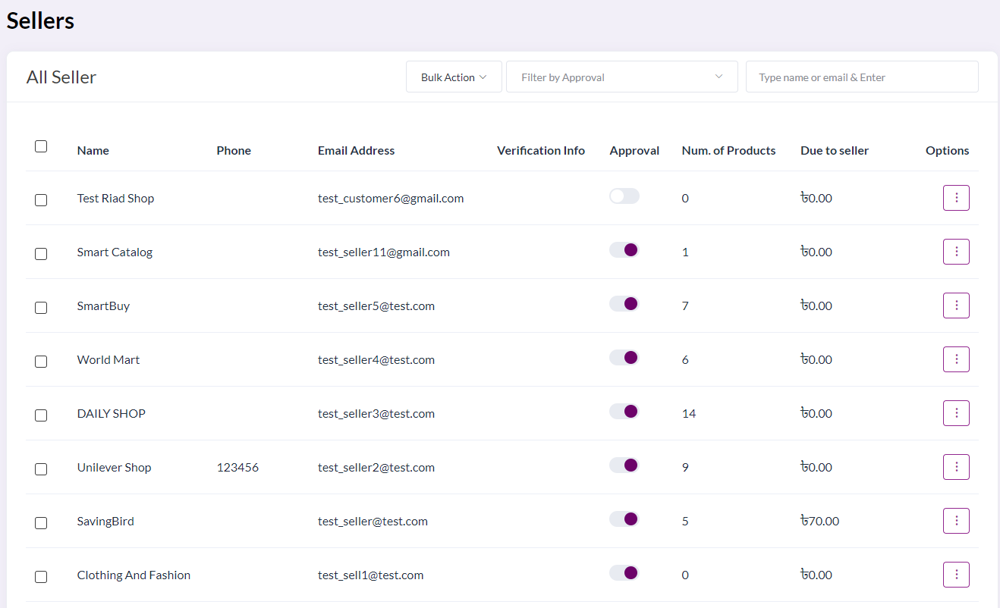
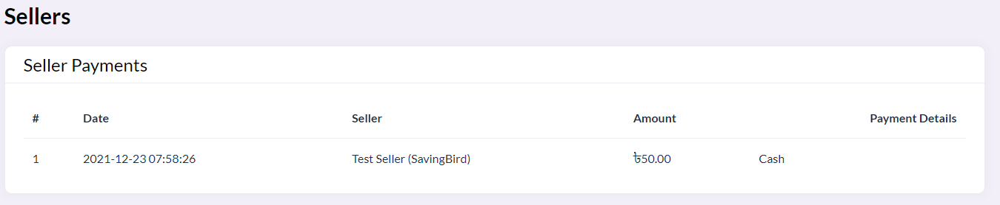
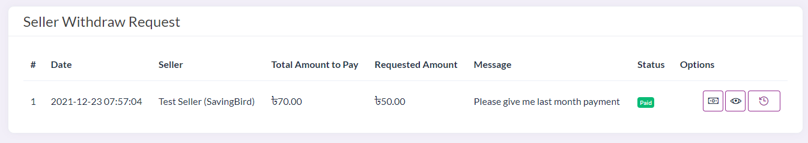
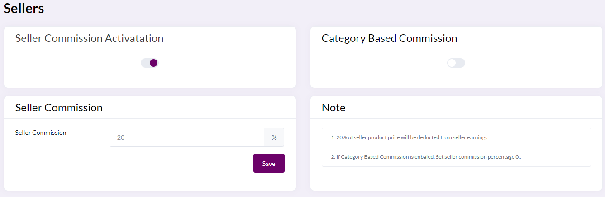
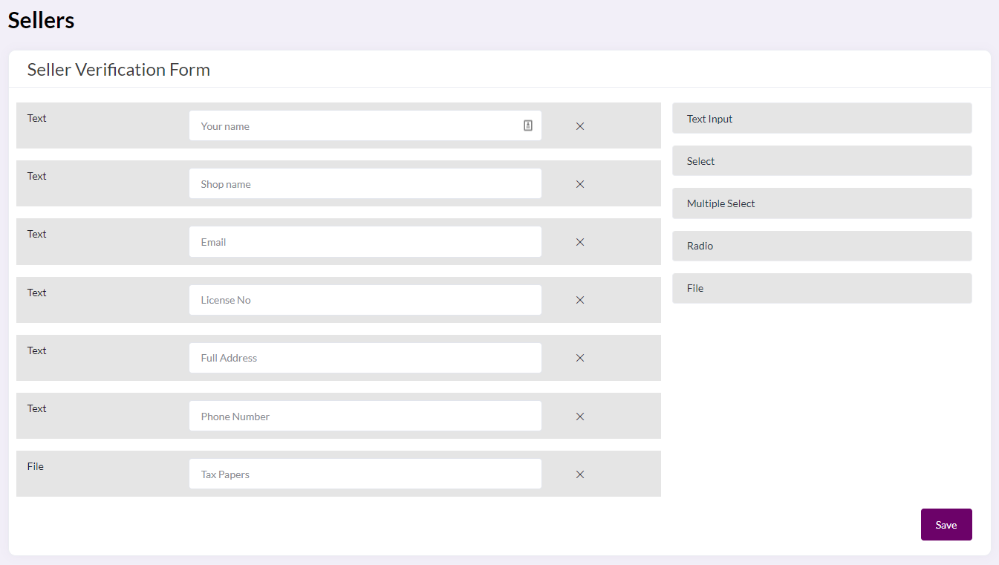

# Seller Features
- [All Seller](#all-seller)
- [Payouts](#payouts)
- [Payout Requests](#payout-requests)
- [Seller Commission](#seller-commission)
- [Seller Verification Form](#seller-verification-form)

# All Seller

**This feature allows us to view and change the list of all the sellers that are registered in the platform**

The fields by which the sellers are indicated are:

**Name** which is the name of the seller

**Phone** which is the phone number of the seller

**Email address** which is the email address of the seller

**Verification info** which is a code used to verify this account

**Approve** is a toggle which determines whether or not this seller is approved to do business in our platform

**Number of products** is the number of products the seller has listed in the platform

**Due to seller** is the amount of money that is currently pending to be paid to the seller based on the transactions they have made

# Payouts

**This feature allows us to see the payments made to sellers in the site**

# Payout Requests

**This feature allows us to view and change the payment requests made by sellers in the site**

# Seller Commission

**This feature allows us to view and change the commission given to sellers in the site based on the sales made**

# Seller Verification Form

**This feature allows us to create a form by defining the various fields in order to collect details about new sellers in the platform**

This form is captain customizable according to what is needed. The customization consists of various type of input fields including text input, select, multiple select, radio, and file.

**Text input** is a simple text entry field

**Select** refers to having the option of selecting a an option amongst multiple that are offered

**Multiple select** refers to question in which multiple options can be selected

**Radio** refers to radio buttons which is similar to select buttons

**File** is where a file can be uploaded in the field
